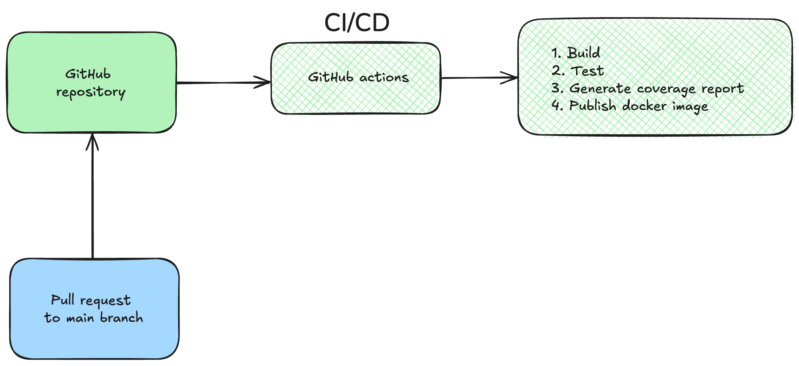

# github-actions-poc
This project is a proof of concept to understand how to implement GitHub Actions in a Java project.



### Build JAR file
```
mvn clean install
```

### Code coverage report generation with Jacoco
If everything runs successfully, check the report in:
`${local_path}/target/site/jacoco/index.html`

---

### Additional
You can visit the following pull requests to see the coverage reports generated by 'GitHub Actions' pipeline:

❌ [Coverage under 80%](https://github.com/franciscolarrocca/github-actions-poc/pull/5) | [Related pipeline](https://github.com/franciscolarrocca/github-actions-poc/actions/runs/10155676957) 

:white_check_mark: [Coverage up 80%](https://github.com/franciscolarrocca/github-actions-poc/pull/6) | [Related pipeline](https://github.com/franciscolarrocca/github-actions-poc/actions/runs/10155679628/job/28082796251)
